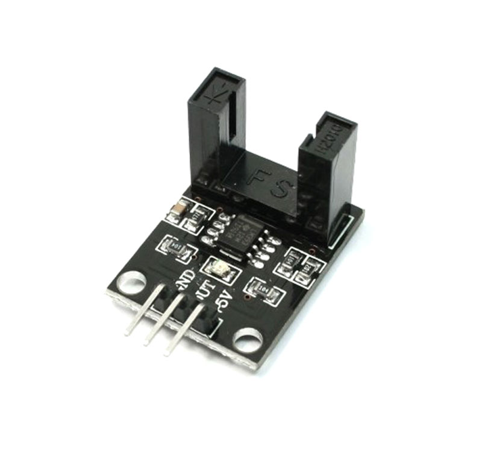
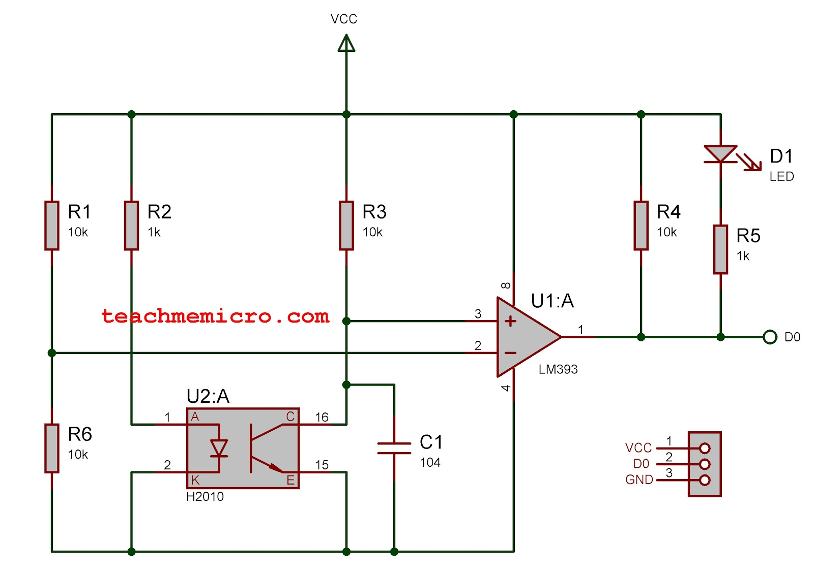
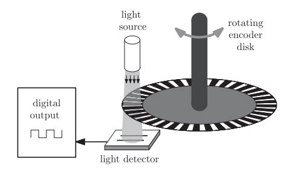
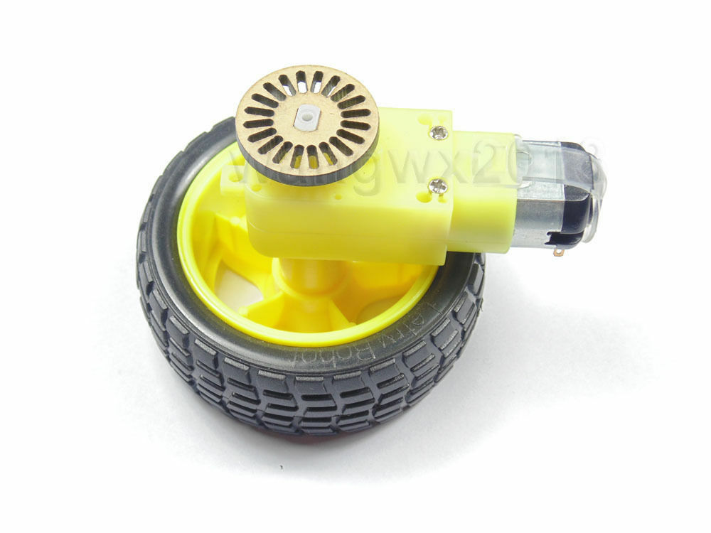

# TwoWheelRobot-ArduinoLab
一下图片均来自连接[网址](https://www.teachmemicro.com/lm393-ir-module-motor-speed-sensor/)
与步进电机和舵机不同，如果不使用某种反馈机制，直流电机的精确控制几乎是不可能的。如果你的应用需要保持电机速度恒定或根据外部刺激调整速度，那么你肯定需要反馈机制。本教程的目标是开发一个简单的电机速度传感器，以实现更智能的直流电机控制。

该编码器模块具有两列垂直排列的元件，一列是红外 LED，另一列是光电晶体管。每当红外 LED 与光电晶体管之间的光路被遮挡时，D0 引脚会变为高电平。


将此模块称为 LM393 速度传感器。实际上，LM393 是一个比较器 IC，而不是严格意义上的传感器。它的功能是将来自光电传感器的模拟信号转换为数字信号，以便更容易处理。


我们可以看到，该模块的电路非常简单。当红外 LED 和光电晶体管之间没有遮挡时，比较器的正负端子之间的电压相等。

当光电晶体管被遮挡时，它会产生更高的电压，使比较器的正端子电压高于负端子电压。因此，D0 引脚将输出一个等于 VCC 的高电平电压。
通过适当的安装，编码器上的缝隙会阻挡或允许红外 LED 的光线通过。这将产生一系列脉冲信号，其频率与电机的转速成正比。


所示的轮式编码器有 20 个缝隙。因此，计数到 20 个脉冲意味着车轮已经旋转了一圈。


```c++
attachInterrupt(0, pulsecount, RISING);

void pulsecount(){
    counter++;
}
```
转数将会是：    
$$
revolutions=\frac{counter}{20}
$$
电机速度通常以每分钟转数（RPM）表示。由于我们已经知道如何计算电机的旋转圈数，现在只需要在每分钟内检查转数即可。我们可以通过 loop() 函数中的 millis() 函数来实现这一点。
```c++int rpm;
void loop(){
 static uint32_t previousMillis;
 if (millis() - previousMillis >= 1000) {
        rpm = (counter/20)*60;      
        counter = 0;
        previousMillis += 1000;
 }
}
```


# OLED 显示
```c++
#include <U8g2lib.h>
#include <Wire.h>

// 根据您的 OLED 类型和连接方式，选择合适的构造函数
// 这里以常见的 SSD1306 128x64 I2C 接口的 OLED 为例
U8G2_SSD1306_128X64_NONAME_F_HW_I2C u8g2(U8G2_R0, /* reset=*/ U8X8_PIN_NONE);

void setup() {
  u8g2.begin();
  u8g2.clearBuffer();                   // 清除内部缓冲区
  u8g2.setFont(u8g2_font_ncenB08_tr);   // 设置字体

  // 在指定位置绘制字符串
  u8g2.drawStr(0, 10, "CangzhouJiaoTong");
  u8g2.drawStr(0, 25, "C&C++ Practice");
  u8g2.drawStr(0, 40, "Qilong Jiang");
  u8g2.drawStr(0, 55, "201510242");

  u8g2.sendBuffer();                    // 将缓冲区内容发送到显示屏
  delay(2000);                          // 延迟 2 秒
}

void loop() {

}

```


# 单电机PID测试
```c++
#include <TimerOne.h> // 使用TimerOne库，需要安装

double samplingPeriod = 100; // Time for encoder readings
volatile unsigned long previousTime = 0;
static volatile unsigned long lastDebounceTime = 0; // Time for debounce

double currentRPM = 0;
double filteredRPM = currentRPM;
double alpha = 0.08; // Exponential moving average filter

volatile int pulseCount = 0; // Number of pulses read by Arduino
int slotsCount = 20; // Number of slots

int pwmPin = 3;

// PID constants
double kp = 1;
double ki = 1;
double kd = 0.01;

// PID variables
double setPoint = 100.0; // Target RPM (Set Point)

double currentError = 0;     // e(n)
double previousError = 0;    // e(n-1)
double twoStepBackError = 0; // e(n-2)

double controlValue = 0;      // c(n)
double previousControlValue = 0; // c(n-1)
double sampleTime = 0.1;      // Ts (100ms)

double pidOutput = 0;
void encoderInterrupt();
void timerISR();
void setup() 
{
  Serial.begin(9600);
  attachInterrupt(0, encoderInterrupt, RISING); // Read pulses using interrupt
  pinMode(pwmPin, OUTPUT);

  // 使用Timer1设置定时中断，采样周期为 100ms
  Timer1.initialize(100000); // 定时器周期为 100,000 微秒 (100 ms)
  Timer1.attachInterrupt(timerISR); // 绑定定时器中断函数
}

void loop() 
{
  // 更新设定点 (Set Point) 的增减
  if (digitalRead(4)) // Increment Set Point
  {
    setPoint = setPoint + 10;
    delay(500);
  }

  if (digitalRead(5)) // Decrement Set Point
  {
    setPoint = setPoint - 10;
    delay(500);
  }
}

void encoderInterrupt()
{
  if (digitalRead(2) && (micros() - lastDebounceTime >= 500)) // Debounce mechanism
  {
    lastDebounceTime = micros();
    pulseCount++;  
  }  
}


double calculatePID() {
  currentError = setPoint - filteredRPM;

  // PID 差分方程
  controlValue = previousControlValue + 
                 (kp + (kd / sampleTime)) * currentError +
                 (-kp + ki * sampleTime - (2 * kd / sampleTime)) * previousError +
                 (kd / sampleTime) * twoStepBackError;

  // 更新历史变量
  previousControlValue = controlValue;
  twoStepBackError = previousError;
  previousError = currentError;

  // 限制 PID 输出范围
  if (controlValue >= 255) {
    controlValue = 255;
  }
  if (controlValue < 0) {
    controlValue = 0;
  }
  return controlValue;
}


// 定时器中断服务函数 (每 100ms 执行一次)
void timerISR() {
  // 计算当前 RPM
  currentRPM = (pulseCount * 60000.0) / (samplingPeriod * slotsCount);
  filteredRPM = alpha * currentRPM + (1.0 - alpha) * filteredRPM; // Exponential moving average filter
  pulseCount = 0;

  // 计算 PID 输出
  pidOutput = calculatePID();
  analogWrite(pwmPin, int(pidOutput));

  // 打印数据用于调试
  Serial.print(pidOutput);     // Control variable (CV)
  Serial.print(",");
  Serial.print(setPoint);      // Set Point (SP)
  Serial.print(",");
  Serial.println(filteredRPM); // Process Variable (PV)
}
```

